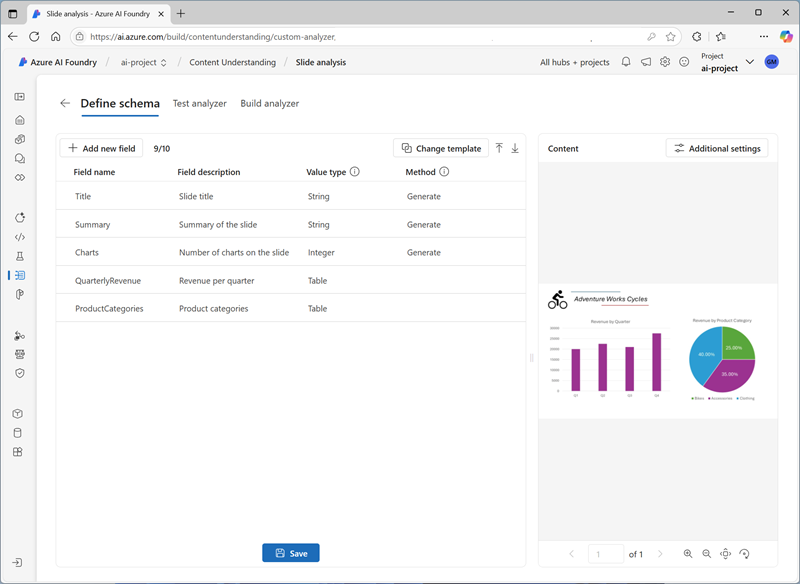

---
lab:
  title: Extraire des informations à partir de contenu multimodal
  description: 'Utilisez Azure AI Content Understanding pour extraire des informations à partir de documents, d''images, d''enregistrements audio et de vidéos.'
---

# Extraire des informations à partir de contenu multimodal

Dans cet exercice, vous utilisez Azure Content Understanding pour extraire des informations à partir d’un large éventail de types de contenu ; y compris une facture, une image d’une diapositive contenant des graphiques, un enregistrement audio d’un message vocal et un enregistrement vidéo d’une téléconférence.

Cet exercice prend environ **40** minutes.

## Créer un hub et un projet Azure AI Foundry

Les fonctionnalités d’Azure AI Foundry que nous allons utiliser dans cet exercice nécessitent un projet basé sur une ressource de *hub* Azure AI Foundry.

1. Dans un navigateur web, ouvrez le [portail Azure AI Foundry](https://ai.azure.com) à l’adresse `https://ai.azure.com` et connectez-vous en utilisant vos informations d’identification Azure. Fermez les conseils ou les volets de démarrage rapide ouverts la première fois que vous vous connectez et, si nécessaire, utilisez le logo **Azure AI Foundry** en haut à gauche pour accéder à la page d’accueil, qui ressemble à l’image suivante (fermez le volet **Aide** s’il est ouvert) :

    

1. Dans le navigateur, accédez à `https://ai.azure.com/managementCenter/allResources` et sélectionnez **Créer un nouveau**. Choisissez ensuite l’option permettant de créer une **ressource de hub AI**.
1. Dans l’assistant **Créer un projet**, saisissez un nom valide pour votre projet et sélectionnez l’option permettant de créer un nouveau hub. Utilisez ensuite le lien **Renommer le hub** pour spécifier un nom valide pour votre nouveau hub, développez les **Options avancées** et définissez les paramètres suivants pour votre projet :
    - **Abonnement** : *votre abonnement Azure*
    - **Groupe de ressources** : *créez ou sélectionnez un groupe de ressources*
    - **Région** :  Sélectionnez l’un des emplacements suivants (*au moment de l’écriture, la compréhension du contenu Azure AI n’est disponible que dans ces régions*) :
        - Australie Est
        - Suède Centre
        - USA Ouest

    > **Note** : si vous travaillez dans un abonnement Azure dans lequel les stratégies sont utilisées pour restreindre les noms de ressources autorisés, vous devrez peut-être utiliser le lien en bas de la boîte de dialogue **Créer un projet** pour créer le hub à l’aide du portail Azure.

    > **Conseil** : si le bouton **Créer** est toujours désactivé, veillez à renommer votre hub en une valeur alphanumérique unique.

1. Attendez que votre projet soit créé.

## Télécharger le contenu 

Le contenu que vous allez analyser se trouve dans une archive .zip. Téléchargez-le et extrayez-le dans un dossier local.

1. Dans un nouvel onglet de navigateur, téléchargez [content.zip](https://github.com/microsoftlearning/mslearn-ai-information-extraction/raw/main/Labfiles/content/content.zip) à partir de `https://github.com/microsoftlearning/mslearn-ai-information-extraction/raw/main/Labfiles/content/content.zip` et enregistrez-le dans un dossier local.
1. Extrayez le fichier *content.zip* téléchargé et affichez les fichiers qu’il contient. Vous allez utiliser ces fichiers pour générer différents analyseurs Content Understanding dans cet exercice.

> **Remarque** : Si vous souhaitez uniquement explorer l’analyse d’une modalité spécifique (documents, images, vidéos ou audio), vous pouvez passer à la tâche appropriée ci-dessous. Pour une expérience optimale, parcourez chaque tâche pour apprendre à extraire des informations de différents types de contenu.

## Extrayez des informations à partir de documents

Vous allez créer un analyseur Azure AI Content Understanding capable d'extraire des informations à partir de factures. Vous commencerez par définir un schéma basé sur un exemple de facture.

### Définir un schéma pour l’analyse des factures

1. Dans l'onglet du navigateur contenant la page d'accueil de votre projet Azure AI Foundry, dans le volet de navigation à gauche, sélectionnez **Compréhension du contenu**.
1. Sur la page **Compréhension du contenu**, sélectionnez l'onglet **Tâche personnalisée** en haut.
1. Sur la page Tâche personnalisée de compréhension du contenu, sélectionnez **+ Créer**, et créez une tâche avec les paramètres suivants :
    - **Nom de la tâche** : `Invoice analysis`
    - **Description** : `Extract data from an invoice`
    - **Analyse du contenu d'un fichier unique** : *Sélectionné*
    - **Paramètres avancés** :
        - **Connexion aux services Azure AI** : *La ressource Azure AI Services dans votre hub Azure AI Foundry*
        - **Compte de stockage Azure Blob** : *le compte de stockage par défaut de votre hub Azure AI Foundry*
1. Attendez que la tâche soit créée.

    > **Conseil** : en cas d’erreur d’accès au stockage, attendez une minute, puis réessayez. Les autorisations pour un nouveau hub peuvent prendre quelques minutes à se propager.

1. Dans la page **Définir le schéma** , chargez le **fichier invoice-1234.pdf** à partir du dossier dans lequel vous avez extrait des fichiers de contenu. Ce fichier contient la facture suivante :

    

1. Dans la page **Définir le schéma** , après avoir chargé le fichier de facture, sélectionnez le **modèle d’extraction** de données de facture, puis sélectionnez **Créer**.

    Le modèle d’*analyse de facture* inclut les champs les plus courants que l’on trouve dans les factures. Vous pouvez utiliser l'éditeur de schéma pour supprimer les champs suggérés dont vous n'avez pas besoin et ajouter les champs personnalisés qui vous sont utiles.

1. Dans la liste des champs suggérés, sélectionnez **BillingAddress**. Ce champ n'est pas nécessaire pour le format de facture que vous avez téléchargé, utilisez donc l'icône **Supprimer le champ** (**&#128465;**) qui apparaît dans la ligne du champ sélectionné pour le supprimer.
1. Supprimez maintenant les champs suggérés suivants, qui ne sont pas nécessaires pour votre schéma de facturation :
    - BillingAddressRecipient
    - CustomerAddressRecipient
    - CustomerId
    - CustomerTaxId
    - DueDate
    - InvoiceTotal
    - PaymentTerm
    - PreviousUnpaidBalance
    - PurchaseOrder
    - RemittanceAddress
    - RemittanceAddressRecipient
    - ServiceAddress
    - ServiceAddressRecipient
    - ShippingAddress
    - ShippingAddressRecipient
    - TotalDiscount
    - VendorAddressRecipient
    - VendorTaxId
    - TaxDetails
1. Utilisez le bouton **+ Ajouter un nouveau champ** pour ajouter les champs suivants, en sélectionnant **Enregistrer les modifications** (**&#10003 ;**) pour chaque nouveau champ :

    | Nom du champ | Description du champ | Type de valeur | Method |
    |--|--|--|--|
    | `VendorPhone` | `Vendor telephone number` | Chaîne | Extract |
    | `ShippingFee` | `Fee for shipping` | Number | Extract |

1. Dans la ligne du champ **Éléments** , notez que ce champ est une *table* (elle contient la collection d’éléments dans la facture). Sélectionnez l’icône **Modifier** (&#9638 ;) pour ouvrir une nouvelle page avec ses sous-champs.
1. Supprimez les sous-champs suivants du tableau **Éléments** :
    - Date
    - ProductCode
    - Unité
    - TaxAmount
    - TaxRate
1. Utilisez le bouton **OK** pour confirmer les modifications et revenir au niveau supérieur du schéma de facture.

1. Vérifiez que votre schéma final correspond à celui-ci, puis sélectionnez **Enregistrer**.

    

1. Dans la page **Analyseur de test**, si l’analyse ne démarre pas automatiquement, sélectionnez **Exécuter l’analyse**. Ensuite, attendez que l'analyse soit terminée.

1. Passez en revue les résultats de l’analyse, qui devraient ressembler à ce qui suit :

    

1. Affichez les détails des champs identifiés dans le volet **Champs**.

### Construire et tester un analyseur de factures

Maintenant que vous avez entraîné un modèle pour extraire les champs des factures, vous pouvez créer un analyseur à utiliser avec des documents similaires.

1. Sélectionnez la page **Liste des analyseurs**, puis sélectionnez **+ Créer un analyseur** et créez un nouvel analyseur avec les propriétés suivantes (saisies exactement comme indiqué ici) :
    - **Nom :** `invoice-analyzer`
    - **Description** : `Invoice analyzer`
1. Attendez que l’analyseur soit prêt (utilisez le bouton **Actualiser** pour vérifier).
1. Une fois l'analyseur créé, sélectionnez le lien **invoice-analyzer**. Les champs définis dans le schéma de l’analyseur s’affichent.
1. Dans la page **invoice-analyzer**, sélectionnez l'onglet **Test**.
1. Utilisez le bouton **+ Charger des fichiers de test** pour charger **invoice-1235.pdf** à partir du dossier dans lequel vous avez extrait les fichiers de contenu, puis cliquez sur **Exécuter l’analyse** pour extraire les données de champ de la facture.

    La facture analysée ressemble à ceci :

    

1. Vérifiez le volet **Champs** et assurez-vous que l'analyseur a extrait les champs corrects de la facture test.
1. Passez en revue le volet **Résultats** pour voir la réponse JSON que l’analyseur retournerait à une application cliente.
1. Sous l’onglet **Exemple de code**, affichez l’exemple de code que vous pouvez utiliser pour développer une application cliente qui utilise l’interface REST Content Understanding pour appeler votre analyseur.
1. Fermez la page **invoice-analyzer**.

## Extraire des informations à partir d’images

Vous allez créer un analyseur Azure AI Content Understanding capable d'extraire des informations à partir d'une diapositive contenant des graphiques.

### Définir un schéma pour l’analyse d’images

1. Dans l'onglet du navigateur contenant la page d'accueil de votre projet Azure AI Foundry, dans le volet de navigation à gauche, sélectionnez **Compréhension du contenu**.
1. Sur la page **Compréhension du contenu**, sélectionnez l'onglet **Tâche personnalisée** en haut.
1. Sur la page Tâche personnalisée de compréhension du contenu, sélectionnez **+ Créer**, et créez une tâche avec les paramètres suivants :
    - **Nom de la tâche** : `Slide analysis`
    - **Description** : `Extract data from an image of a slide`
    - **Analyse du contenu d'un fichier unique** : *Sélectionné*
    - **Paramètres avancés** :
        - **Connexion aux services Azure AI** : *La ressource Azure AI Services dans votre hub Azure AI Foundry*
        - **Compte de stockage Azure Blob** : *le compte de stockage par défaut de votre hub Azure AI Foundry*
1. Attendez que la tâche soit créée.

    > **Conseil** : en cas d’erreur d’accès au stockage, attendez une minute, puis réessayez. Les autorisations pour un nouveau hub peuvent prendre quelques minutes à se propager.

1. Dans la page **Définir le schéma** , chargez le fichier **slide-1.jpg** à partir du dossier dans lequel vous avez extrait des fichiers de contenu. Sélectionnez ensuite le modèle **Analyse d'image** et cliquez sur **Créer**.

    Le modèle *d’analyse d’image* n’inclut aucun champ prédéfini. Vous devez définir des champs pour décrire les informations que vous souhaitez extraire.

1. Utilisez le bouton **+ Ajouter un nouveau champ** pour ajouter les champs suivants, en sélectionnant **Enregistrer les modifications** (**&#10003 ;**) pour chaque nouveau champ :

    | Nom du champ | Description du champ | Type de valeur | Method |
    |--|--|--|--|
    | `Title` | `Slide title` | Chaîne | Generate |
    | `Summary` | `Summary of the slide` | Chaîne | Generate |
    | `Charts` | `Number of charts on the slide` | Integer | Generate |

1. Utilisez bouton **+ Ajouter un nouveau champ** pour ajouter un nouveau champ nommé `QuarterlyRevenue` avec la description `Revenue per quarter` avec le type de valeur **Table**, puis enregistrez le nouveau champ (**&#10003 ;**). Ensuite, dans la nouvelle page des sous-champs de table qui s’ouvre, ajoutez les sous-champs suivants :

    | Nom du champ | Description du champ | Type de valeur | Method |
    |--|--|--|--|
    | `Quarter` | `Which quarter?` | Chaîne | Generate |
    | `Revenue` | `Revenue for the quarter` | Number | Generate |

1. Sélectionnez **Précédent** (l’icône de flèche près du bouton **Ajouter un sous-champ**) ou **&#10003 ; OK** pour revenir au niveau supérieur de votre schéma et utiliser **+ Ajouter un nouveau champ** pour ajouter un nouveau champ nommé `ProductCategories` avec la description avec la `Product categories`table** de type valeur**, puis enregistrer le nouveau champ (**&#10003 ;**). Ensuite, dans la nouvelle page des sous-champs de table qui s’ouvre, ajoutez les sous-champs suivants :

    | Nom du champ | Description du champ | Type de valeur | Method |
    |--|--|--|--|
    | `ProductCategory` | `Product category name` | Chaîne | Generate |
    | `RevenuePercentage` | `Percentage of revenue` | Number | Generate |

1. Sélectionnez **Précédent** (l’icône de flèche près du bouton **Ajouter un sous-champ** ) ou **&#10003 ; OK** pour revenir au niveau supérieur de votre schéma et vérifier qu’il ressemble à ceci. Ensuite, sélectionnez **Enregistrer**.

    

1. Dans la page **Analyseur de test**, si l’analyse ne démarre pas automatiquement, sélectionnez **Exécuter l’analyse**. Ensuite, attendez que l'analyse soit terminée.

    La diapositive analysée se présente comme suit :

    

1. Passez en revue les résultats de l’analyse, qui devraient ressembler à ce qui suit :

    

1. Affichez les détails des champs identifiés dans le volet **Champs** , en développant les champs **QuarterlyRevenue** et **ProductCategories** pour afficher les valeurs de sous-champ.

### Générer et tester un analyseur

Maintenant que vous avez entraîné un modèle pour extraire des champs à partir de diapositives, vous pouvez créer un analyseur à utiliser avec des images de diapositives similaires.

1. Sélectionnez la page **Liste des analyseurs**, puis sélectionnez **+ Créer un analyseur** et créez un nouvel analyseur avec les propriétés suivantes (saisies exactement comme indiqué ici) :
    - **Nom :** `slide-analyzer`
    - **Description** : `Slide image analyzer`
1. Attendez que l’analyseur soit prêt (utilisez le bouton **Actualiser** pour vérifier).
1. Une fois l'analyseur créé, sélectionnez le lien **slide-analyzer**. Les champs définis dans le schéma de l’analyseur s’affichent.
1. Dans la page **slide-analyzer**, sélectionnez l'onglet **Test**.
1. Utilisez le bouton **+ Charger des fichiers de test** pour charger **slide-2.pdf** à partir du dossier dans lequel vous avez extrait les fichiers de contenu, puis cliquez sur **Exécuter l’analyse** pour extraire les données de champ de la facture.

    La diapositive analysée se présente comme suit :

    

1. Vérifiez le volet **Champs** et assurez-vous que l'analyseur a extrait les champs corrects de l'image de glissement.

    > **Remarque** : La diapositive 2 n’inclut pas de catégorie de produit non noyée, de sorte que les données de chiffre d’affaires de la catégorie de produit ne sont pas trouvées.

1. Passez en revue le volet **Résultats** pour voir la réponse JSON que l’analyseur retournerait à une application cliente.
1. Dans l'onglet **Exemple de code**, consultez l'exemple de code que vous pouvez utiliser pour développer une application cliente qui utilise l'interface REST de compréhension du contenu pour appeler votre analyseur.
1. Fermez la page **slide-analyzer**.

## Extraire des informations d’un enregistrement audio de messagerie vocale

Vous allez créer un analyseur Azure AI Content Understanding qui peut extraire des informations d’un enregistrement audio d’un message vocal.

### Définir un schéma pour l’analyse audio

1. Dans l'onglet du navigateur contenant la page d'accueil de votre projet Azure AI Foundry, dans le volet de navigation à gauche, sélectionnez **Compréhension du contenu**.
1. Sur la page **Compréhension du contenu**, sélectionnez l'onglet **Tâche personnalisée** en haut.
1. Sur la page Tâche personnalisée de compréhension du contenu, sélectionnez **+ Créer**, et créez une tâche avec les paramètres suivants :
    - **Nom de la tâche** : `Voicemail analysis`
    - **Description** : `Extract data from a voicemail recording`
    - **Analyse du contenu d'un fichier unique** : *Sélectionné*
    - **Paramètres avancés** :
        - **Connexion aux services Azure AI** : *La ressource Azure AI Services dans votre hub Azure AI Foundry*
        - **Compte de stockage Azure Blob** : *le compte de stockage par défaut de votre hub Azure AI Foundry*
1. Attendez que la tâche soit créée.

    > **Conseil** : en cas d’erreur d’accès au stockage, attendez une minute, puis réessayez. Les autorisations pour un nouveau hub peuvent prendre quelques minutes à se propager.

1. Dans la page **Définir le schéma** , chargez le fichier **call-1.mp3** à partir du dossier dans lequel vous avez extrait des fichiers de contenu. Sélectionnez ensuite le modèle **d’analyse de transcription Speech**, puis sélectionnez **Créer**.
1. Dans le volet **Contenu** à droite, sélectionnez **Obtenir l’aperçu de transcription** pour afficher une transcription du message enregistré.

    Le modèle *d'analyse de transcription* de discours ne comprend aucun champ prédéfini. Vous devez définir des champs pour décrire les informations que vous souhaitez extraire.

1. Utilisez le bouton **+ Ajouter un nouveau champ** pour ajouter les champs suivants, en sélectionnant **Enregistrer les modifications** (**&#10003 ;**) pour chaque nouveau champ :

    | Nom du champ | Description du champ | Type de valeur | Method |
    |--|--|--|--|
    | `Caller` | `Person who left the message` | Chaîne | Generate |
    | `Summary` | `Summary of the message` | Chaîne | Generate |
    | `Actions` | `Requested actions` | Chaîne | Generate |
    | `CallbackNumber` | `Telephone number to return the call` | Chaîne | Generate |
    | `AlternativeContacts` | `Alternative contact details` | Liste de chaînes | Generate |

1. Vérifiez que votre flux de données ressemble à ceci. Ensuite, sélectionnez **Enregistrer**.

    

1. Dans la page **Analyseur de test**, si l’analyse ne démarre pas automatiquement, sélectionnez **Exécuter l’analyse**. Ensuite, attendez que l'analyse soit terminée.

    L’analyse audio peut prendre un certain temps. Pendant que vous attendez, vous pouvez lire le fichier audio ci-dessous :

    <video controls src="https://github.com/MicrosoftLearning/mslearn-ai-information-extraction/raw/refs/heads/main/Instructions/Labs/media/call-1.mp4" title="Appel 1" width="300">
        <track src="https://github.com/MicrosoftLearning/mslearn-ai-information-extraction/raw/refs/heads/main/Instructions/Labs/media/call-1.vtt" kind="captions" srclang="en" label="English">
    </video>

    **Remarque** : Cet audio a été généré à l’aide de l’IA.

1. Passez en revue les résultats de l’analyse, qui devraient ressembler à ce qui suit :

    

1. Affichez les détails des champs identifiés dans le volet **Champs** , en développant le champ **AlternativeContacts** pour afficher les valeurs répertoriées.

### Générer et tester un analyseur

Maintenant que vous avez entraîné un modèle pour extraire des champs à partir de messages vocaux, vous pouvez créer un analyseur à utiliser avec des enregistrements audio similaires.

1. Sélectionnez la page **Liste des analyseurs**, puis sélectionnez **+ Créer un analyseur** et créez un nouvel analyseur avec les propriétés suivantes (saisies exactement comme indiqué ici) :
    - **Nom :** `voicemail-analyzer`
    - **Description** : `Voicemail audio analyzer`
1. Attendez que l’analyseur soit prêt (utilisez le bouton **Actualiser** pour vérifier).
1. Une fois l'analyseur créé, sélectionnez le lien **voicemail-analyzer**. Les champs définis dans le schéma de l’analyseur s’affichent.
1. Dans la page **voicemail-analyzer**, sélectionnez l'onglet **Test**.
1. Utilisez le bouton **+ Télécharger les fichiers de test** pour télécharger le fichier **call-2.mp3** à partir du dossier dans lequel vous avez extrait les fichiers de contenu, puis cliquez sur **Lancer l'analyse** pour extraire les données de champ du fichier audio.

    L’analyse audio peut prendre un certain temps. Pendant que vous attendez, vous pouvez lire le fichier audio ci-dessous :

    <video controls src="https://github.com/MicrosoftLearning/mslearn-ai-information-extraction/raw/refs/heads/main/Instructions/Labs/media/call-2.mp4" title="Appel 2" width="300">
        <track src="https://github.com/MicrosoftLearning/mslearn-ai-information-extraction/raw/refs/heads/main/Instructions/Labs/media/call-2.vtt" kind="captions" srclang="en" label="English">
    </video>

    **Remarque** : Cet audio a été généré à l’aide de l’IA.

1. Vérifiez le volet **Champs** et assurez-vous que l'analyseur a extrait les champs corrects du message vocal.
1. Passez en revue le volet **Résultats** pour voir la réponse JSON que l’analyseur retournerait à une application cliente.
1. Dans l'onglet **Exemple de code**, consultez l'exemple de code que vous pouvez utiliser pour développer une application cliente qui utilise l'interface REST de compréhension du contenu pour appeler votre analyseur.
1. Fermez la page **voicemail-analyzer**.

## Extraire des informations d’un enregistrement de conférence vidéo

Vous allez créer un analyseur Azure AI Content Understanding capable d'extraire des informations à partir d'un enregistrement vidéo d'une conférence téléphonique.

### Définir un schéma pour l’analyse vidéo

1. Dans l'onglet du navigateur contenant la page d'accueil de votre projet Azure AI Foundry, dans le volet de navigation à gauche, sélectionnez **Compréhension du contenu**.
1. Sur la page **Compréhension du contenu**, sélectionnez l'onglet **Tâche personnalisée** en haut.
1. Sur la page Tâche personnalisée de compréhension du contenu, sélectionnez **+ Créer**, et créez une tâche avec les paramètres suivants :
    - **Nom de la tâche** : `Conference call video analysis`
    - **Description** : `Extract data from a video conference recording`
    - **Analyse du contenu d'un fichier unique** : *Sélectionné*
    - **Paramètres avancés** :
        - **Connexion aux services Azure AI** : *La ressource Azure AI Services dans votre hub Azure AI Foundry*
        - **Compte de stockage Azure Blob** : *le compte de stockage par défaut de votre hub Azure AI Foundry*
1. Attendez que la tâche soit créée.

    > **Conseil** : en cas d’erreur d’accès au stockage, attendez une minute, puis réessayez. Les autorisations pour un nouveau hub peuvent prendre quelques minutes à se propager.

1. Sur la page **Définir le schéma**, téléchargez le fichier **meeting-1.mp4** à partir du dossier dans lequel vous avez extrait les fichiers de contenu. Sélectionnez ensuite le modèle **Analyse vidéo** et cliquez sur **Créer**.
1. Dans le volet **Contenu** à droite, sélectionnez **Obtenir l’aperçu de transcription** pour afficher une transcription du message enregistré.

    Le modèle *d’analyse vidéo* extrait les données de la vidéo. Il n’inclut aucun champ prédéfini. Vous devez définir des champs pour décrire les informations que vous souhaitez extraire.

1. Utilisez le bouton **+ Ajouter un nouveau champ** pour ajouter les champs suivants, en sélectionnant **Enregistrer les modifications** (**&#10003 ;**) pour chaque nouveau champ :

    | Nom du champ | Description du champ | Type de valeur | Method |
    |--|--|--|--|
    | `Summary` | `Summary of the discussion` | Chaîne | Generate |
    | `Participants` | `Count of meeting participants` | Integer | Generate |
    | `ParticipantNames` | `Names of meeting participants` | Liste de chaînes | Generate |
    | `SharedSlides` | `Descriptions of any PowerPoint slides presented` | Liste de chaînes | Generate |
    | `AssignedActions` | `Tasks assigned to participants` | Table |  |

1. Lorsque vous entrez le champ **AssignedActions** , dans la table des sous-champs qui s’affiche, créez les sous-champs suivants :

    | Nom du champ | Description du champ | Type de valeur | Method |
    |--|--|--|--|
    | `Task` | `Description of the task` | Chaîne | Generate |
    | `AssignedTo` | `Who the task is assigned to` | Chaîne | Generate |

1. Sélectionnez **Précédent** (l’icône de flèche près du bouton **Ajouter un sous-champ** ) ou **&#10003 ; OK** pour revenir au niveau supérieur de votre schéma et vérifier qu’il ressemble à ceci. Ensuite, sélectionnez **Enregistrer**.

1. Vérifiez que votre flux de données ressemble à ceci. Ensuite, sélectionnez **Enregistrer**.

    

1. Dans la page **Analyseur de test**, si l’analyse ne démarre pas automatiquement, sélectionnez **Exécuter l’analyse**. Ensuite, attendez que l'analyse soit terminée.

    L'analyse vidéo peut prendre un certain temps. Pendant que vous attendez, vous pouvez afficher la vidéo ci-dessous :

    <video controls src="https://github.com/MicrosoftLearning/mslearn-ai-information-extraction/raw/refs/heads/main/Instructions/Labs/media/meeting-1.mp4" title="Réunion 1" width="480">
        <track src="https://github.com/MicrosoftLearning/mslearn-ai-information-extraction/raw/refs/heads/main/Instructions/Labs/media/meeting-1.vtt" kind="captions" srclang="en" label="English">
    </video>

    **Remarque** : Cet vidéo a été généré à l’aide de l’IA.

1. Passez en revue les résultats de l’analyse, qui devraient ressembler à ce qui suit :

    

1. Dans le volet **Champs** , affichez les données extraites pour la vidéo, y compris les champs que vous avez ajoutés. Affichez les valeurs de champ qui ont été générées, en développant les champs de liste et de table selon les besoins.

### Générer et tester un analyseur

Maintenant que vous avez entraîné un modèle pour extraire des champs à partir d'enregistrements de conférences téléphoniques, vous pouvez créer un analyseur à utiliser avec des vidéos similaires.

1. Sélectionnez la page **Liste des analyseurs**, puis sélectionnez **+ Créer un analyseur** et créez un nouvel analyseur avec les propriétés suivantes (saisies exactement comme indiqué ici) :
    - **Nom :** `conference-call-analyzer`
    - **Description** : `Conference call video analyzer`
1. Attendez que l’analyseur soit prêt (utilisez le bouton **Actualiser** pour vérifier).
1. Une fois l'analyseur créé, sélectionnez le lien **conference-call-analyzer**. Les champs définis dans le schéma de l’analyseur s’affichent.
1. Sur la page **conference-call-analyzer**, sélectionnez l’onglet **Tester**.
1. Utilisez le bouton **+ Charger les fichiers de test** pour télécharger le fichier **meeting-2.mp4** à partir du dossier dans lequel vous avez extrait les fichiers de contenu, puis lancez l'analyse pour extraire les données de champ du fichier audio.

    L'analyse vidéo peut prendre un certain temps. Pendant que vous attendez, vous pouvez afficher la vidéo ci-dessous :

    <video controls src="https://github.com/MicrosoftLearning/mslearn-ai-information-extraction/raw/refs/heads/main/Instructions/Labs/media/meeting-2.mp4" title="Réunion 2" width="480">
        <track src="https://github.com/MicrosoftLearning/mslearn-ai-information-extraction/raw/refs/heads/main/Instructions/Labs/media/meeting-2.vtt" kind="captions" srclang="en" label="English">
    </video>

    **Remarque** : Cet vidéo a été généré à l’aide de l’IA.

1. Passez en revue le volet **Champs** et affichez les champs extraits par l’analyseur pour la vidéo d’appel de conférence.
1. Passez en revue le volet **Résultats** pour voir la réponse JSON que l’analyseur retournerait à une application cliente.
1. Fermez la page **conference-call-analyzer**.

## Nettoyage

Si vous avez terminé d’utiliser le service Compréhension de contenu, vous devez supprimer les ressources que vous avez créées dans cet exercice pour éviter d’entraîner des coûts Azure inutiles.

1. Dans le portail Azure AI Foundry, accédez à votre hub, sélectionnez votre projet dans la page d'aperçu, puis supprimez-le.
1. Dans le portail Azure, supprimez le groupe de ressources que vous avez créé pour cet exercice.
